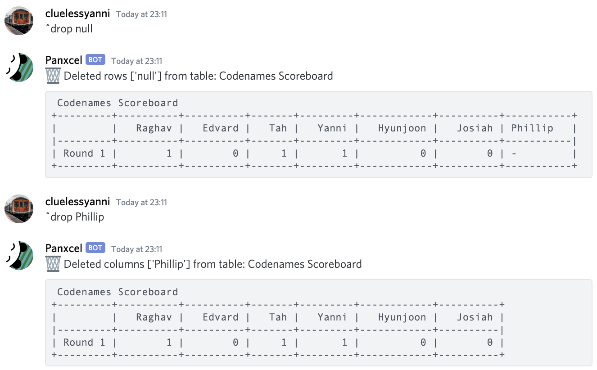
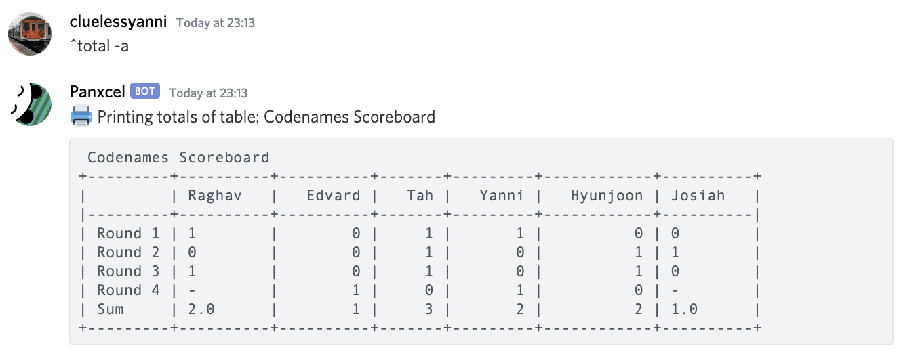

# clueless-bot

Discord is far more than an online social networking tool. The platform allows developers to create a wide variety of bots, allowing them and to bring a range of interactive activities to users' chats, and inject a bit of life into an otherwise passive networking platform. Oddly, despite the widespread use of python for data science, very few python discord bot developers (or none, from observation) have attempted to create some some sort of discord bot that takes advantage of its python's beautifully simple data sciennce packages, such as Pandas.

This project is an attempt to wrap a couple "excel-like" functions into a python-scripted discord bot. At the moment it is relatively primitive, and it merely includes a couple file operation and column/row manipulation commands. At the moment, I can forsee it being a scoreboard tool on discord. Hopefully it will find its way into something more than this!

**Table of Contents**

- [clueless-bot](#clueless-bot)
  - [Quick walkthrough](#quick-walkthrough)
  - [Commands](#commands)
    - [File Operation](#file-operation)
    - [Dataframe Manipulation (Based on Pandas)](#dataframe-manipulation-based-on-pandas)
    - [General useless commands](#general-useless-commands)
  - [Roadmap](#roadmap)

## Quick walkthrough

First create a table, specifying the table name, as well as column names. If your table name is more than one word or if you intend to place more than on word within each cell, remember to place "double quotation marks".

Then start appending rows to the table!

When appending a new row, you must specify every single cell. Otherwise the bot will return an error.

By default the bot generates a null row for demonstration. You can drop it, as well as other columns or rows you have added by mistake.

For scoreboard purposes, you can append the total of each column as a new row.

The `^sel` feature might be particularly useful for viewing a certain set of data, especially when you have many columns or rows in your table.

This is a non-exhaustive list of things you can do with this bot. To check out the many more features, have a look at the list of commands.

## Commands

Currently, to differentiate commands from regular messages, all commands must be accessed with a `^` prefix. The additional arguments required are specified in `[brackets]`. In addition, always use "double quotes"

### File Operation

    ^close       [filename]
        close and save the currently opened table.

    ^create      [filename] [col names]
        create a new table, specifying the table name as well as the column names.

    ^list        
        returns all available tables on my computer!

    ^open        [filename]
        open a table, specifying its name.
        simultaneously, the bot will change its status to playing [your table name]

    ^print       [filename]
        print a table, specifying its name.

    ^save        [filename]
        save a table, specifying its name.
        note: the table is saved when ^closed or manipulated with commands in the next section.

### Dataframe Manipulation (Based on Pandas)

The following commands can only be run when a table is in appending mode. Or in other words run these commands after an `^open` or `^create` operation.

    ^append      [row name] [values]
        append one new row, specifying the row name, and values of all cells in the row.

    ^appendcol   [cols]
        append empty new column(s), specifying the name(s) for them

    ^appendtotal append total of column to bottom row
        same as ^total, except doing so appends the row of totals to the table.

    ^drop        [rows]
        delete rows, specifying the names of the row(s) to be removed.

    ^dropcol     [cols]
        delete cols, specifying the names of the columns(s) to be removed.

    ^sel         [rows]
        temporarily view selected rows by specifying their names.

    ^selcol      [cols]
        temporarily view selected columns by specifying their names.

    ^total       
        temporarily view the sum of every single cell for each column.

### General useless commands

There's not much going on here. I normally run them just to check that the bot is actually running.

    ^about     
        check version of clueless-bot. forever at version 0!

    ^ping        [your crazy thoughts]
        pong your crazy thoughts

## Roadmap

1. Actually host the bot online, so that different servers can use the bot at the same time, and to ensure that the tables are not all jammed up on my local hard drive.

2. Support for more row and column operations, as well as other methods of displaying the table.